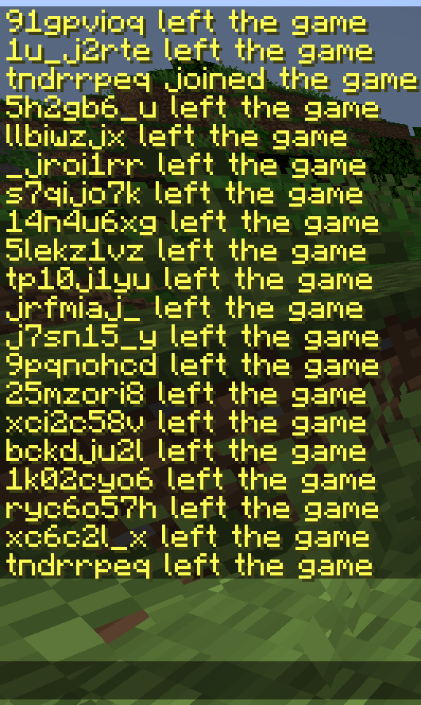

# Mass Join Bot for Minecraft Servers

This project enables mass joining of Minecraft servers by creating multiple bots that connect simultaneously using random usernames.

## Features

- Creates multiple Minecraft bots that join a specified server.
- Uses random usernames from a `pseudo.txt` file.
- Handles events such as connections, disconnections, kicks, and errors for each bot.
- Run `generatorpseudo.js` to generate nicknames for bots.

## Screenshot



## Installation

### Installation Steps

1. **Clone the repository**
   ```bash
   git clone https://github.com/kzoxmazpx/mcmassjoin.git
   cd mcmassjoin
